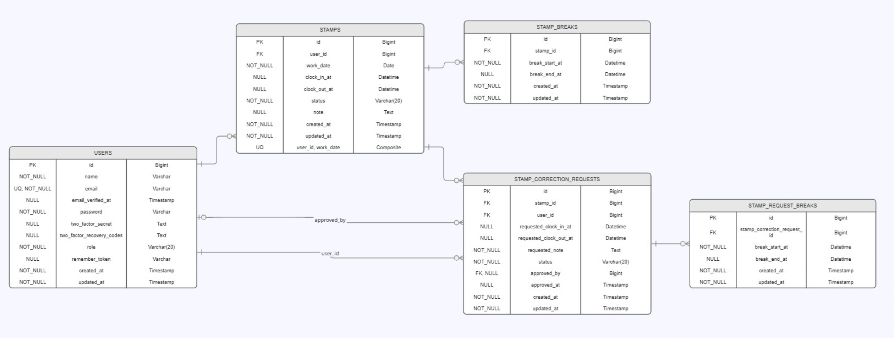

# coachtech 勤怠管理アプリ

本アプリケーションは、一般ユーザーが出勤・休憩・退勤の打刻を行い、  
管理者がスタッフの勤怠確認・修正・承認・CSV出力を行える勤怠管理システムです。

---

## 【 環境構築 】
本アプリケーションは、Dockerを利用して環境構築を行います。

### 1. リポジトリのクローン

任意の作業ディレクトリで以下を実行し、開発環境を取得します。
```bash
git clone git@github.com:mik1003dev/KintaiApp.git
cd KintaiApp
```

### 2. 環境変数の準備

```bash
cd src
cp .env.example .env
```
.envのDB設定を以下に変更します。
```bash
DB_CONNECTION=mysql
DB_HOST=mysql
DB_PORT=3306
DB_DATABASE=laravel_db
DB_USERNAME=laravel_user
DB_PASSWORD=laravel_pass
```

### 3. コンテナの起動とLaravelセットアップ
```bash
# プロジェクトルートへ戻る
cd ..

# コンテナの起動
docker compose up -d --build

# PHPコンテナに入る
docker compose exec php bash

# Laravelセットアップ
composer install
php artisan key:generate
php artisan migrate --seed
```

---
## 【 使用技術 】
-  言語　PHP 8.1  
-  フレームワーク　Laravel 8.x  
-  DB　MySQL 8.0.26  
-  Webサーバ　nginx 1.21.1
-  認証　Laravel Fortify（カスタム拡張）
-  メール確認　MailHog
-  仮想環境　Docker

---
## 【 ER図 】



---
## 【 画面遷移図 】
### 利用者側（勤怠）
```
  未ログイン
        ↓
  PG01 会員登録
        ↓
  PG02 メール認証
        ↓
  PG03 ログイン
        ↓
  PG04 勤怠打刻
        ├─ 出勤
        ├─ 休憩入
        ├─ 休憩戻
        ├─ 退勤
        ├─ PG05 勤怠一覧
        │   └─ PG06 勤怠詳細
        │       └─ PG07 勤怠修正申請
        ├─ PG08 申請一覧
        └─ ログアウト
```
### 管理者側（勤怠管理）
```
  未ログイン
        ↓
  PG09 管理者ログイン
        ↓
  PG10 日次勤怠一覧
        ├─ PG11 勤怠詳細
        │   └─ 勤怠修正
        ├─ PG12 スタッフ一覧
        │   └─ PG13 スタッフ別月次勤怠一覧
        │       ├─ PG14 CSV出力
        │       └─ PG11 勤怠詳細
        ├─ PG15 申請一覧
        │   └─ PG16 申請承認
        └─ ログアウト
```

---
## 【 URL 】
- トップ：http://localhost/  
- ユーザーログイン：http://localhost/login
- ユーザー登録：http://localhost/register
- 勤怠打刻：http://localhost/attendance
- 管理者ログイン：http://localhost/admin/login
- 管理者勤怠一覧：http://localhost/admin/attendance/list
- phpMyAdmin：http://localhost:8080
- MailHog：http://localhost:8025
---

## 【 主な機能】

### 利用者側
- PG01： 会員登録
- PG02： メール認証
- PG03： ログイン
- PG04： 勤怠打刻（出勤 / 休憩入 / 休憩戻 / 退勤）
- PG05： 月次勤怠一覧
- PG06： 勤怠詳細
- PG07： 勤怠修正申請（退勤後のみ申請可 / 当日の未来時刻は申請不可 / 承認待ち中は再申請不可）
- PG08： 申請一覧（承認待ち / 承認済み）

### 管理者側
- PG09： 管理者ログイン
- PG10： 日次勤怠一覧
- PG11： 勤怠詳細・勤怠修正（当日の未来時刻は修正不可）
- PG12： スタッフ一覧
- PG13： スタッフ別月次勤怠一覧
- PG14： CSV出力
- PG15： 申請一覧（承認待ち / 承認済み）
- PG16： 申請承認

---
## 【 ログイン情報 】
`php artisan migrate --seed` により、以下のユーザーが作成されます。

### 管理者ユーザー
- URL： http://localhost/admin/login
- メールアドレス： `admin@example.com`
- パスワード： `password`

### 一般ユーザー
- URL： http://localhost/login
- メールアドレス： `user@example.com`
- パスワード： `password`

### スタッフ一覧確認用ユーザー
- `taro@example.com`
- `hanako@example.com`
- `ichiro@example.com`

※ パスワードはいずれも `password` です。

---
## 【 認証（ログイン / 会員登録 / メール認証） 】
本アプリの認証には、Fortifyをベースに独自UI・バリデーションでカスタマイズしています。

- 一般ユーザーは会員登録後、メール認証を完了すると勤怠機能を利用できます。
- 管理者ユーザーは管理者専用ログイン画面からログインします。
- ログイン種別に応じて、一般ユーザーと管理者ユーザーのログイン先を分岐しています。

## 【 フォームリクエストの利用箇所一覧 】
| フォームリクエスト名 | 役割 | 使用される場所 |
|-----------|------|----------------|
| **AttendanceCorrectionRequest** | 一般ユーザーの勤怠修正申請バリデーション | AttendanceController（updateRequest） |
| **AdminAttendanceUpdateRequest** | 管理者の勤怠修正バリデーション | AttendanceController（adminAttendanceUpdate） |

---
## 【 テスト 】
PHPコンテナ内で以下を実行します。
```bash
php artisan test
```

### テストファイル一覧
テストは `src/tests/Feature` 配下に機能単位で配置しています。  
開発プロセスシートに対応するテストには、テストメソッド直前のコメントに `テストケースID: 1-1` のような枝番付きIDを記載しています。  
シート外で補足確認しているテストには、`追加ケース` とテスト概要を記載しています。

| テストファイル | 確認内容 |
|---|---|
| `ChecklistCaseTest.php` | 開発プロセスシートのテストケースを枝番ごとに確認する補足テスト |
| `AuthenticationFeatureTest.php` | 会員登録、一般ユーザーログイン、管理者ログイン、メール認証 |
| `AttendanceFeatureTest.php` | 勤怠打刻画面、出勤、休憩、退勤、一般ユーザーの勤怠一覧・勤怠詳細 |
| `AttendanceCorrectionFeatureTest.php` | 一般ユーザーの勤怠修正申請、退勤前・未来時刻の申請制御、申請一覧 |
| `AdminAttendanceFeatureTest.php` | 管理者のアクセス制御、勤怠一覧、勤怠詳細、勤怠修正、未来時刻の修正制御、申請承認、CSV出力 |

### テストケースIDの確認例
```php
// テストケースID: 1-3 会員登録時、8文字未満パスワードのバリデーションを確認する。
```

---
## 【 トラブルシューティング 】
Windows / WSL を使用している場合、初回起動時にstorageへの書き込み権限エラーが発生する場合があります。
その場合は下記を実行してください。
```
docker compose exec php bash
chown -R www-data:www-data storage bootstrap/cache
chmod -R 775 storage bootstrap/cache
```
